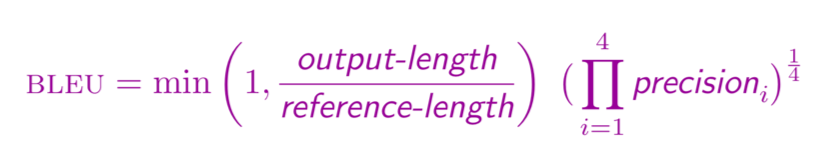
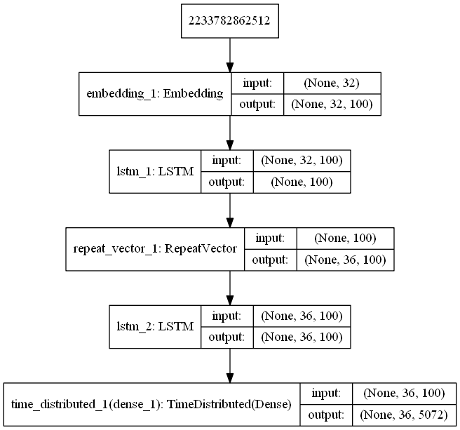
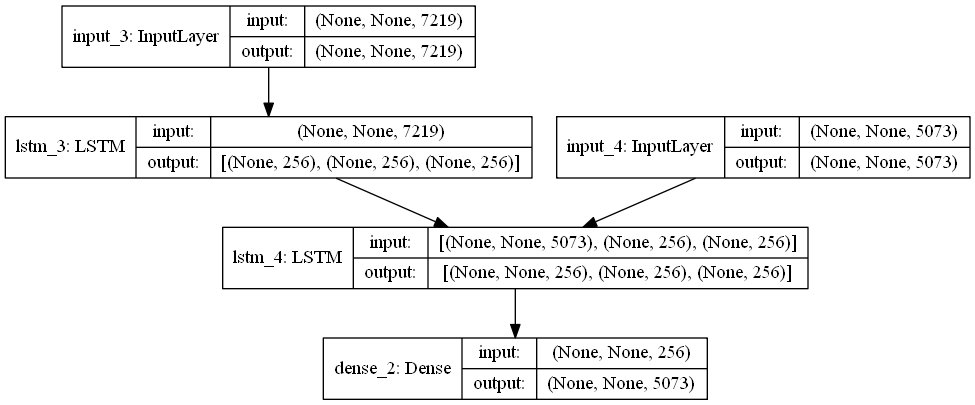
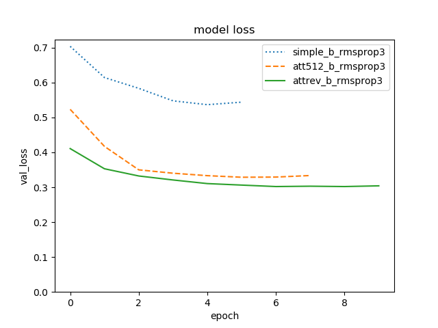
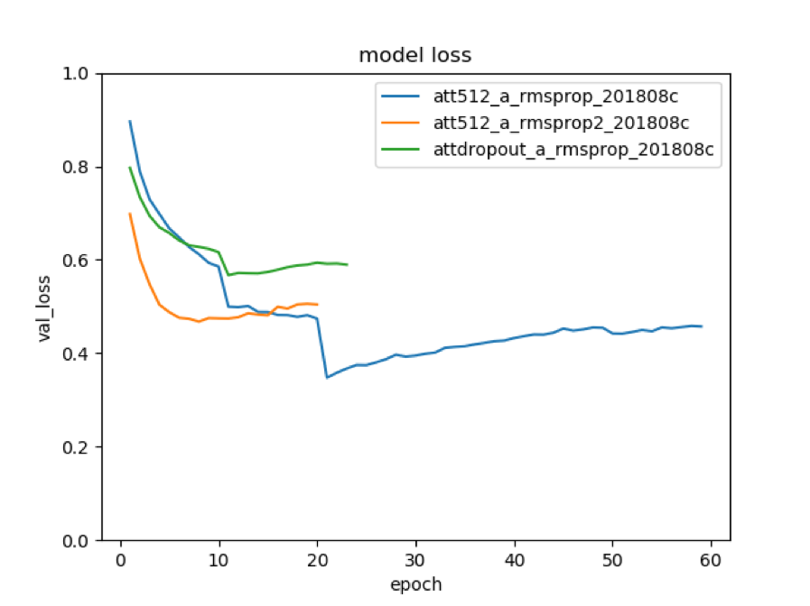
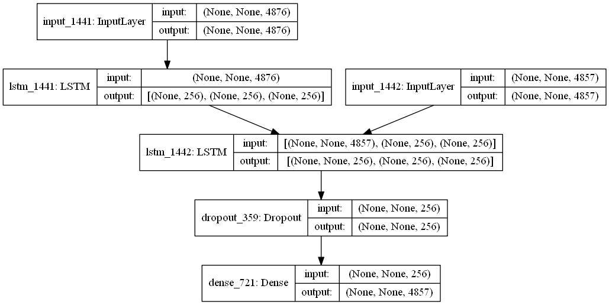
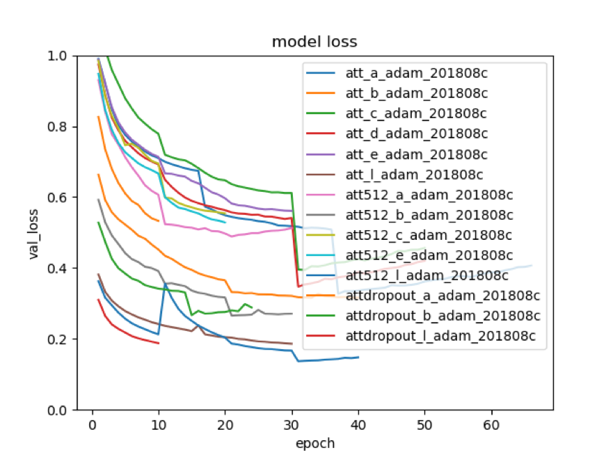
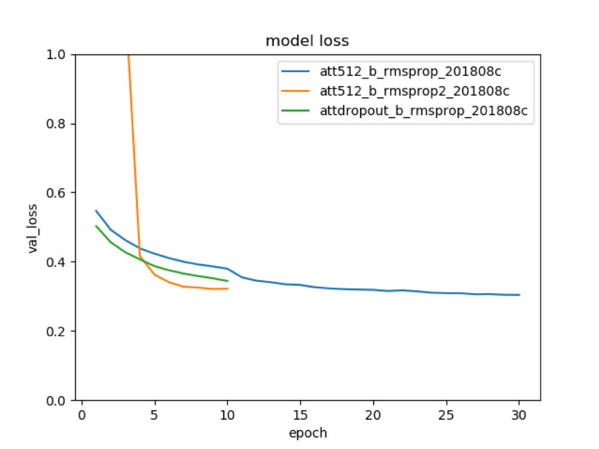

### Machine Learning Engineer Nanodegree
## Capstone Project
# Machine Translation from Swedish to English with Keras
Nicholas Cottrell, nic@cottrell.net

February, 2019

## I. Definition
<!--
_(approx. 1-2 pages)_
-->
### Project Overview

<!--
In this section, look to provide a high-level overview of the project in layman’s terms. Questions to ask yourself when writing this section:
- _Has an overview of the project been provided, such as the problem domain, project origin, and related datasets or input data?_
- _Has enough background information been given so that an uninformed reader would understand the problem domain and following problem statement?_
-->

In recent years, machine translation (MT) with neural networks has proven that it can deliver superior results compared to older rule-based or statistical MT. Google and Facebook have been able to quickly put services into production based on neural machine translation (NMT) given their access to huge data sources and including private hand-coded parallel corpora for the target languages. 

There are a number of attempts to create similar systems based on open source NN modeling tools such as Keras and Tensorflow (open-sourced from Google’s research) and PyTorch (an alternative approach to tensor modeling open-sourced by Facebook’s research teams). These attempts use open-source parallel corpora for training input and examples online give a hint at what can be achieved, while most make large simplifications and don’t handle many edge cases. 

For example, one example for English to German starts by lowercasing all training data and removing all punctuation. Word case in German is extremely important and punctuation can affect the translation choice. There is a difference between “Hello!” and “Hello?”. 

There are a number of related NLP fields using neural networks which flow into the translation problem. For example, there are solutions which can train unsupervised on German input text to discover word components. For example, the German word _Fingerspitzengefühl_ (Literally: the fingertip feeling)  made up of _Finger + Spitzen + Gefühl_ (finger + tip + feeling). 

Since all the MT modules take one-hot encoded inputs, the size of the vocabulary is a limiting factor in defining and training models. Some approaches simply limit the vocabulary size, ignoring uncommon words completely. Due to the agglutinative native of Germanic languages, there are many more “word” permutations that in English. 

Some research has explored handling input as single characters, or breaking down input words into 2 or 3-letter long chunks. For example, Fingerspitzengefühl would be split into _Fin + ger + spi + tze + nge + füh + l_. This approach can successfully limit the vocabulary size (maximum would be C^n where C is the number of different characters (say 35 including accents etc.) and n is the chunk size (3 in this example). This gives almost 300.000 vocabulary which is still very large. The other downside is that number of these 3-letter components themselves have any semantic value.  

A better system would be to combine intelligent component detection as part of a cleaning/preparation step before training the translation model. Thus, an input sentence “Er hat das Fingerspitzengefühl” (Translation: “He has an instinct for tactfulness”) would be broken into components _“Er” + “hat” + “das” + “Finger” + “Spitzen” + “Gefühl”_. Note that we are capitalizing the component words since they themselves are nouns which are naturally capitalized in German. This helps us reduce the vocabulary size and lets the model fall back to a word-by-word translation if it doesn’t have enough data. Whether this can be achieved fully automatically has yet to be shown.


### Problem Statement
<!--
In this section, you will want to clearly define the problem that you are trying to solve, including the strategy (outline of tasks) you will use to achieve the desired solution. You should also thoroughly discuss what the intended solution will be for this problem. Questions to ask yourself when writing this section:
- _Is the problem statement clearly defined? Will the reader understand what you are expecting to solve?_
- _Have you thoroughly discussed how you will attempt to solve the problem?_
- _Is an anticipated solution clearly defined? Will the reader understand what results you are looking for?_
-->
For this project, the problem to be solved is how to quickly, cheaply and accurately translate written text in a foreign language into something the user can understand (preferably their first language). The scope of translation could include spoken word, or even using optical character recognition via augmented reality framework on mobile devices to recognize text from street signs, menus and other materials. For the purposes of this project, I intend to focus on text already in digital format and deal with the already numerous challenges of processing and transforming that into a translated version which accurately conveys the meaning and non-textual content (numbers, dates, etc.) that can also handle real world input such as spelling mistakes, and unseen inputs (such as named entities - names of people, places, organizations etc.).
 
There is already much research on major language pairs such as English to French, Spanish or Chinese. Although the more dissimilar the language the harder it is to achieve a natural and accurate result. Current neural translation models have proved to provide much better translation models for dissimulate language without any significant pre- or post-processing when compared to other rule-based or statistical methods. 

However, for this project I want to focus on a less-common language pair: English↔Swedish both of which I speak natively.  


### Metrics

<!--
In this section, you will need to clearly define the metrics or calculations you will use to measure performance of a model or result in your project. These calculations and metrics should be justified based on the characteristics of the problem and problem domain. Questions to ask yourself when writing this section:
- _Are the metrics you’ve chosen to measure the performance of your models clearly discussed and defined?_
- _Have you provided reasonable justification for the metrics chosen based on the problem and solution?_
-->

Machine Translation systems have been in development since the 1940s and there is a wide body of parallel corpora available - many in the form of sentence pairs that have been either created by hand or at least reviewed by a human. These sentence pairs provide a single “correct translation” for the source language text. However, obviously, there is more than one way to translate any given sentence and so some data sources include multiple candidate translations for any given input. In either case, there is an algorithm for evaluating the quality of a machine translation called BLEU which uses n-grams (usually 1 to 3 words) and compares the output from the model against the candidates and then scores based on the following steps:

1. Collect N-gram overlap between machine translation output and reference translation 
1. Compute precision for n-grams of size 1 to 4

1. Add brevity penalty (for too short translations)

This algorithm is computationally efficient, gives very similar results to human ‘evaluators’ assuming the candidate translations are accurate and is very widely used in the MT field. 

Luckily [NLTK](https://www.nltk.org/) provides a ready-made implementation in its [bleu_score.py](https://www.nltk.org/_modules/nltk/translate/bleu_score.html)


## II. Analysis
<!--
_(approx. 2-4 pages)_
-->

### Data Exploration

<!--
In this section, you will be expected to analyze the data you are using for the problem. This data can either be in the form of a dataset (or datasets), input data (or input files), or even an environment. The type of data should be thoroughly described and, if possible, have basic statistics and information presented (such as discussion of input features or defining characteristics about the input or environment). Any abnormalities or interesting qualities about the data that may need to be addressed have been identified (such as features that need to be transformed or the possibility of outliers). Questions to ask yourself when writing this section:
- _If a dataset is present for this problem, have you thoroughly discussed certain features about the dataset? Has a data sample been provided to the reader?_
- _If a dataset is present for this problem, are statistics about the dataset calculated and reported? Have any relevant results from this calculation been discussed?_
- _If a dataset is **not** present for this problem, has discussion been made about the input space or input data for your problem?_
- _Are there any abnormalities or characteristics about the input space or dataset that need to be addressed? (categorical variables, missing values, outliers, etc.)_
-->

The data in the `swe.txt` file simply contains pairs of sentences in Utf-8 ordered by shortest first like:

```
Run!	Spring!
Who?	Vem?
Help!	Hjälp!
``` 
up to the longest like:

```
If you take a child outside and point at the moon, they will look at the moon. If you do the same thing with a dog, it will look at your finger.	Om du tar med ett barn ut och pekar på månen, så tittar barnet på månen. Gör du samma sak med en hund så tittar den på ditt finger.
The Tatoeba Project, which can be found online at tatoeba.org, is working on creating a large database of example sentences translated into many languages.	Tatoebaprojektet, som återfinns online på tatoeba.org, går ut på att skapa en stor databas med exempelmeningar översatta till många språk.
```
The longest sentences are about 160 characters long, with the longest being 24 words in English, and only 20 words in Swedish due to the agglunative nature of that language. 

The dataset contains 17,300 language pairs which is sufficient for this experiment in comparing tokenization schemes, but real-world machine translation systems are often trained one _millions_ of sentence pairs.

In the middle are sentences like:
```
Tom is a billionaire.	Tom är miljardär.
Tom is a bit strange.	Tom är lite udda.
Tom is a bit strange.	Tom är lite konstig.
Tom is a firefighter.	Tom är brandman.
Tom is a good friend.	Tom är en bra vän.
Tom is a good person.	Tom är en bra person.
Tom is a neurologist.	Tom är neurolog.
```
It appears as if all proper nouns (i.e. people's names) have been 'normalized' already to 'Tom'. There are also very few named entities. For example, there are only 7 sentence pairs containing the word "London", and only **one** that includes "Stockholm". This means that for this particular data set, the planned tokenizer `ReplaceProper` will have very little affect here.

A brief visual analysis of the verbs in the data set, shows that more than 80% of sentences are in present tense. This is quite expected for simple example sentences or spoken dialog, but isn't very representative of certain types of text like legal or medical. Both English and Swedish use common compound formations to format tenses, e.g. "He _had been_ bitten by the spider" and these types of phrases do not appear in the dataset either. Therefore this makes the planned `Word2Phrase` tokenizer less useful on this data set, and unlikely to give noticely different results to the basic `SimpleLines` tokenizer. 

#### Dataset Tokenization

After a lot of experimentation and coding, I created six different tokenizer classes in the tokenizers.py file:

|	| Tokenizer class	|Description|
|---|-------------------|-----------------|
|a  |	`SimpleLines`	|Tokenize on spaces and punctuation, and keep punctuation but not spaces
|b	|Hyphenate	|Use a [hypenate library](https://bitbucket.org/fhaxbox66/pyhyphen) to use `SimpleLines` first then break down longer words into sub-parts to reduce the dimensionality|
|c |	`Word2Phrase`	|Tokenize as above, but combine popular phrases into a single token, e.g. "good-bye" and "Eiffel Tower" will be single tokens.
|d	|`ReplaceProper`	|Tokenize, but replace proper nouns with a placeholder so we don't pollute the model with possibly unlimited [named entities](https://en.wikipedia.org/wiki/Named-entity_recognition) .|
|e 	|`PosTag`	|Tokenize as above, but run a [part-of-speech tagger](https://en.wikipedia.org/wiki/Part-of-speech_tagging)  on each sentence. This will result in token like "duck.VF" and "duck.NN" for verbs and nouns.|
|l 	|`LetterByLetter`	|Tokenize the sentence into individual words, preserving all spaces and punctuation. This gives a very small input space but should be possible for an attention-based model.|

### Exploratory Visualization
<!--
In this section, you will need to provide some form of visualization that summarizes or extracts a relevant characteristic or feature about the data. The visualization should adequately support the data being used. Discuss why this visualization was chosen and how it is relevant. Questions to ask yourself when writing this section:
- _Have you visualized a relevant characteristic or feature about the dataset or input data?_
- _Is the visualization thoroughly analyzed and discussed?_
- _If a plot is provided, are the axes, title, and datum clearly defined?_
-->

The data from the following table is created by the `print_vocab_summary()` function in the `tokenizers_summary.py` file:

| Code	| Tokenizer |	English Vocab	| English Max Length	| Swedish Vocab	| Swedish Max Length|
|----|----|----|-----|---|----|
|a	|`SimpleWords`	|5053	|36	|7193	|32|
|b 	|`Hyphenate`	|4044	|73	|3421	|71|
|c 	|`Word2Phrase`	|5506	|33	|7637	|31|
|d 	|`ReplaceProper`	|4836	|36	|4863|	32|
|e 	|`PosTag`	|5542	|36	|8349	|32|
|l 	|`LetterByLetter`	|74	|159	|78	|142|

This indicates that our training corpus has only about 5000 different English words (based on `SimpleWords` above), whereas an article from the [Economist](https://www.economist.com/johnson/2013/05/29/lexical-facts) indicates that an adult speakers has a normal vocabulary range of about 20-35,000 words. So our sample includes less than 25% of common words, but should still be sufficient for this experiment since it gives a reasonable sample for performing different tokenization schemes.

You can see from the table above that our dataset actually contains very few proper nouns and ambiguous parts of speech. The vocabularly size for `ReplaceProper` is only about 4% reduced compared to the original `SimpleWords`. And the `PosTag` vocabularly is only about 10% increased by adding part of speech information to each input token. 
 
 The max length is mostly important for my very first “simple.Simple” model which does not use the “attention” approach and so hard-codes the sentence size into the model itself. Shorter sentences are padded with “null” token during training and at runtime. In production, any sentence longer than the maximum length from the training set needs to be truncated before being input, thus deleting the last words in the input sentence.

### Algorithms and Techniques
<!--
In this section, you will need to discuss the algorithms and techniques you intend to use for solving the problem. You should justify the use of each one based on the characteristics of the problem and the problem domain. Questions to ask yourself when writing this section:
- _Are the algorithms you will use, including any default variables/parameters in the project clearly defined?_
- _Are the techniques to be used thoroughly discussed and justified?_
- _Is it made clear how the input data or datasets will be handled by the algorithms and techniques chosen?_
-->

For this research, I wanted to explore deep learning techniques with [TensorFlow](https://github.com/tensorflow/tensorflow). I ended up choosing [Keras](https://keras.io) for defining and training the different models since this framework provides a good level of abstraction from TensorFlow and would allow the testing of different Machine Learning backends (like [Theano](https://github.com/Theano/Theano)) in the future.

#### Models

Machine translation approaches with neural networks are known as "sequence to sequence" problems [Sutsker, 2014].  
  
Almost all approaches involve:
- Encoding the input sentence tokens an abstract representation.
- Manipulating this encoding.
- Decoding it back into our target sequence.

The encoders and decoders can be any type of neural networks but many examples simply use RNNs for both the encoders and decoders.

##### Simple model

I started with a very simple Recurrent Neural Network model defined in `simple.py` based on work by [ChunML](https://chunml.github.io/ChunML.github.io/project/Sequence-To-Sequence/). This model expected fixed-width input, and had the following layers:

1. An `Embedding` layer to represent word embeddings
1. A [Long short-term memory](https://en.wikipedia.org/wiki/Long_short-term_memory) (LSTM) Layer which can process data sequentially and keep its hidden state through time. This first LSTM 'decodes' the input sentence tokens from the source language (Swedish)
1. A `RepeatVector` layer which TODO  
1. Another LSTM layer to TODO
1. Ending with a TimeDistributed and Dense layer, wuth softmax acivation to TODO

This model can be visualized as:
 

This model requires fixed input lengths, and therefore limits the maximum sentence length to the maximum length of the training set. Since this simple model has no concept of context (i.e. it receives the input sentence as a single input) it performs very poorly on the size of training data available here. Even with an immense training set, it would require a prohibitively dense model to achieve any sort of real-world accuracy.

This simple model gives very poor results because it lacks a way to consider context in the translation process. A more advanced approach uses two separate encoder and decoder models.

#### Attention model with separate encoder/decoder

The algorithm is roughly as follows:
- We tokenize the input sentences (in Swedish) and the corresponding target sentences in English into a sequence using one of the tokenizers
- An encoder LSTM turns input tokens to 2 state vectors
    (we keep the last LSTM state and discard the outputs).
- A decoder LSTM is trained to turn the target sequences into
    the same sequence but offset by one timestep in the future,
    a training process called "[teacher forcing](https://machinelearningmastery.com/teacher-forcing-for-recurrent-neural-networks/)" which helps train such models faster.
- In inference mode, when we want to decode unknown input sequences, we:
    - Tokenize the input sentence
    - Encode the input tokens into state vectors
    - Start with a target sequence of size 1 (just the start-of-sequence token)
    - Feed the state vectors and target sequence to the decoder to produce predictions for the next character
    - Sample the next token using these predictions (we simply use argmax).
    - Append the sampled token to the target sequence
    - Repeat until we generate the end-of-sequence token or we hit the character limit (based on the longest sequence found in the training set).
        
This basic model structure can be visualized as:


By returning the state from the encoder LSTM, we can explicitly handle the `c` and `h` hidden states from the LSTM nodes, and then pass them into the decoder LSTM as an initial state. This lets us uncouple the two models, in a way that allows recursive processing on input tokens during the inference (translation) phase (see `attention3.decode_sequence()`). 

Even the basic attention model provides much better results after only 10 epochs of training. In particular, the nature of the recursive handling of tokens and knowledge of previous tokens already output for this sentence means that common words repetitions that were frequently seen in the output of the Simple model do not occur.

Later on I experiment with variations of this model with greater dimensionality, with a dropout layer, reading the input in reverse order and finally with a Bidirectional wrapper around the encoder LSTM to allow the model to process tokens from the last word backwards as well as the normal forward order.


I was concerned about overfitting on the training data, which was why I experimented with adding the dropout layer. However, the added complexity also meant that I had to reduce the batch size to fit the data into the GPU’s memory for processing making processing slower. Initial results were not promising.

When testing 512 dimensions on the dense layer rather than 256, a smaller batch size was also required for for training to fit into the GPU memory. Initial results seemed to show a slighty lower `val_loss `(i.e. a better model) and slightly better BLEU scores, but not enough initial benefit to justify the extra training time.

If I had more time and resources, I would like to explore even higher dimensionality combined with a bigger dataset to confirm this is an important real-world in building better neural machine translation models.



#### Optimizers

In addition to testing different model designs and tokenization options, I wanted to see which [optimizers](https://keras.io/optimizers/) worked best for each combination, so tested each model/tokenization with the following optimizers:

|Code|Name|Comment|
|----|-----|-----|
|`adam`|[Adam](https://arxiv.org/abs/1412.6980v8)|A gradient-based stochastic optimizer. This optimizer is known to be computationally-efficient and to require little tuning, so should be a good initial choice.
|`sgd`|Stochastic gradient descent|Default parameters of a learning rate of `0.01` and no decay. This option is expected to be more 'stable' than `adam`|
|`sgd2`|Stochastic gradient descent with decay|Defined as `optimizers.SGD(lr=0.01, decay=1e-6, momentum=0.9, nesterov=True)` slowly decreasing the learning rate as the training progressed|
|`rmsprop`|RMSProp|Used the default learning rate of `0.001` and no decay. This optimizer uses an adaptive learning rate and is known as a good choice for recurrent neural networks like our models|
|`rmsprop2`|RMSProp with higher LR|Defined as `optimizers.RMSprop(lr=0.01)`. Given 10x higher initial learning rate so see if the training could quickly reach good results in the first few epochs.|
|`rmsprop3`|RMSProp wih high LR and decay|Defined as `optimizers.RMSprop(lr=0.01, decay=0.00001)`,  # same as previous but with decay


Table X: _Mean Training Times (seconds/epoch) - Model `att`_

|          |   a  |   l |
|----------|-----|-----|
| sgd      | 111 |  174 |
| sgd2     | 123 |  174 |
| rmsprop  | 113 |  174 |
| rmsprop2 | 113 |174 |
| rmsprop3 | 113 | 174 |
| adam     | 114 | 174 |

I was interested what the impact on training for the different optimizers selected would be. However, based on a selection of different samples (such as Attention with tokenizers `a` and `l` above) I concluded that the optimizer would have almost no impact on total training times.

### Min loss - Model `simple`:
|          |    a |    b |    c |    d |    e |    l |
|----------|------|------|------|------|------|------|
| sgd      | 1.6  | 1.03 | 1.68 | 1.59 | 1.62 | 0.63 |
| sgd2     | 1.15 | 0.78 | 1.23 | 1.18 | 1.18 | 0.54 |
| rmsprop  | 0.81 | 0.62 | 0.88 | 0.86 | 0.84 | 0.54 |
| rmsprop2 | 0.68 | 0.54 | 0.74 | 0.73 | 0.72 | 0.9  |
| rmsprop3 | 0.67 | 0.54 | 0.74 | 0.74 | 0.72 | 0.92 |
| adam     | 0.92 | 0.7  | 1.06 | 1.01 | 0.96 | 0.52 |


### Min loss - Model `att`:
|          |    a | b    | c    | d    | e    |    l |
|----------|------|------|------|------|------|------|
| sgd      | 1.62 | 1.21 | 1.75 |      |      | 0.58 |
| sgd2     | 0.95 | 0.68 |      |      |      | 0.49 |
| rmsprop  | 0.59 | 0.36 | 0.63 |      |      | 0.21 |
| rmsprop2 | 0.5  |      |      | 0.50 | 0.50 | 0.16 |
| rmsprop3 | 0.51 |      |      | 0.49 |      | 0.17 |
| adam     | 0.62 |      | 0.71 | 0.65 |      | 0.24 |


For both models, the optimizer can have a huge impact on the accuracy even after 10 epochs of training. The `sgd` models perform worst. `adam` performs well, but `rmsprop2` and `rmsprop3` seem to provide the best results for most combinations of model and tokenizer. Therefore, I decided to focus training on `rmsprop2`.

### Benchmark
<!--
In this section, you will need to provide a clearly defined benchmark result or threshold for comparing across performances obtained by your solution. The reasoning behind the benchmark (in the case where it is not an established result) should be discussed. Questions to ask yourself when writing this section:
- _Has some result or value been provided that acts as a benchmark for measuring performance?_
- _Is it clear how this result or value was obtained (whether by data or by hypothesis)?_
-->

The BLEU function provided by NLTK (above) is one of many different BLEU variations. This particular function gives values between 0.0 and 1.0 depending on the similarity of the produced sentence output compared to the sentence from the dataset pair. Since my models don't perform very well compared to a native speaker, it made sense to use the BLEU-1 scores - i.e. comparing unigrams of output vs target, but the function could support comparing up to 4-grams.

Unfortunately basic BLEU can be "tricked" with repeated input of common words - exactly the sort of output generated by poorly performing neural networks. To better understand with an famous example mentioning the NLTK code itself: 

```python
> reference1 = 'the cat is on the mat'.split()
> reference2 = 'there is a cat on the mat'.split()
> hypothesis1 = 'the the the the the the the'.split()
> references = [reference1, reference2]
> float(modified_precision(references, hypothesis1, n=1)) 
0.2857
```
    
Despite the output being `the the the the the the the` the score is 0.285. The default `sentence_bleu` and `corpus_bleu` functions, however, will automatically discard used words from the reference correctly giving very low scores for poor translations, for example:     
         
```python
> float(sentence_bleu(references, hypothesis1, (1, 0, 0, 0))) 
0.0
```

## III. Methodology
<!--
_(approx. 3-5 pages)_
-->
### Data Preprocessing
<--
In this section, all of your preprocessing steps will need to be clearly documented, if any were necessary. From the previous section, any of the abnormalities or characteristics that you identified about the dataset will be addressed and corrected here. Questions to ask yourself when writing this section:
- _If the algorithms chosen require preprocessing steps like feature selection or feature transformations, have they been properly documented?_
- _Based on the **Data Exploration** section, if there were abnormalities or characteristics that needed to be addressed, have they been properly corrected?_
- _If no preprocessing is needed, has it been made clear why?_
-->
The goal was to perform minimal pre-processing on the sentence pairs, to ensure that the output was correct as possible without any post-processing. Therefore, we do no simply lowercase all characters, but run an algorithm to determine if the first word in a sentence is a proper noun, e.g. "Peter" or "Paris" in which case the word is left unchanged, but all other words are lowercased. See the `clean_line` function in `clean.py`:

```python
# normalize unicode characters
sent = unicodedata.normalize('NFC', sent)
# remove control characters
sent = remove_control_characters(sent)
# remove URLs
sent = re.sub(r'http[s]?://[^\s<>"]+|www\.[^\s<>"]+', ' URL ', sent)
# remove Twitter handles
sent = re.sub(r'(^|[^@\w])@(\w{1,15})\b', ' USER ', sent)
# remove prices
sent = re.sub(r'[$\u20AC\u00A3]\d+[.,]?\d{0,2}', 'PRICE', sent)
# change any remaining euro symbols to dollar :(
sent = re.sub(r'[\u20AC\u00A3]', '$', sent)
# replace special quotes with ascii quotes
sent = sent.translate(_trantab)
# alter language-specific abbreviations etc. [sic]
sent = prepare_line(sent, lang, 'lookup')
```

`prepare_line` includes some language-specific cleanup such as rewriting "I'm" -> "I am", "He's" -> "He is", but "Peter's" to "Peter 's" so that our `SimpleLines` tokenizer which breaks up word tokens based on spaces will handle "Peter" as a separate token, allowing the model to learn that "'s" indicates a possessive marker. In Swedish the correct translation would be "Peters" with no space or single quote and our dataset probably isn't large enough for the model to learn such mapping in general.

### Implementation
<!--
In this section, the process for which metrics, algorithms, and techniques that you implemented for the given data will need to be clearly documented. It should be abundantly clear how the implementation was carried out, and discussion should be made regarding any complications that occurred during this process. Questions to ask yourself when writing this section:
- _Is it made clear how the algorithms and techniques were implemented with the given datasets or input data?_
- _Were there any complications with the original metrics or techniques that required changing prior to acquiring a solution?_
- _Was there any part of the coding process (e.g., writing complicated functions) that should be documented?_
-->

I took an iterative approach to creating a successful outcome. I used an existing Keras example of a “naive” system for German->English which simply pre-processes input by lowercasing input sentences, removing punctuation and tokenizing by spaces. I have trained a model and have baseline BLEU scores. I used the same data sources as for this example, except for Swedish giving me 17,300 sentence pairs to split between training and test sets. I considered this large enough for building a basic model, but in retrospect I think a much larger corpus would have given much better results since my model quality seems to “stall” after only tens of episodes. By stalled, I mean that the `val_loss` did not improve after an entire epoch and so the model checkpoint did not trigger to save the latest model changes to disk.

I wanted to learn about the impact of differences in models and tokenizing methods, so I created a framework to test every permutation of models, tokenizer and optimizer pre-selected and plot the `val_loss` against episodes. I started with every possible combination and let the training run over a week to which were the most promising combinations to do longer/deeper training on.

However, determining what combinations were working best was not trivial. My original plots were epoch vs `val_loss`, however the val_loss metric were comparable for the same tokenizer, when comparing two tokenizers the `val_loss` metric was meaningless. For example, the `Letter2Letter` tokenizer gave a vocabulary of around 60 (upper and lowercase letters, space and punctuation characters), whereas the `Word2Phrase` and `PosTag` tokenizers resulted in vocabularies of close to 100,000. This means that the `a` model with Letter2Letter vocabulary quickly gave low val_loss scores in training, but the translation output was almost nonsensical. Whereas the other models gave output which are often grammatical but not very close in meaning to the original sentence, despite lower `val_loss`.

I continued by increasing the dimensionality of the model in `Attention512` () and adding a dropout layer in `AttentionDropout`. 

In terms of tokenizers, I added several more advanced variations thing simple word breaking on spaces. I confirmed that a new tokenizer (`Hyphenate`) which tries to identify compound words and tokenize on sub-word boundaries (as well as spaces) and confirmed that this decreases `val_loss`.

In the other direction I tested grouping on common noun phrases (rather than splitting words into smaller chunks). This increased the vocabulary size, but I suspect that with sufficient data input this should increase translation accuracy for such noun phrases without negatively affecting overall quality, although it will almost certainly increase training time.
 
I found a way to identify named entities in the training set, and replaced them with placeholders. For example, both “Paris” and “London” would be replaced by a placeholder “NE.1”. The current implementation relies on the HunPos tagger's detection of proper nouns (see `ReplaceProper.tokenize_one`) but there are many more advanced open source named-entity detectors that could be swapped in at a later date. The current implementation simply looks for named entities in the sentence pairs, but has no mechanism to ensure that both sentences have the same number of entities or that the numbers correspond correctly. For example:

- `Sverige besegrades av England på lördag` (literally `Sweden was beated by English...`)
- `England beat Sweden on Saturday`

would be tokenized to:

- `['NE.1', 'besegrades', 'av', 'NE.2', 'på', 'lördag']`
- `['NE.1', 'beat', 'NE.2', 'on', 'Saturday']`

In this example the mappings on NE.1 and NE.2 are reversed which would leave to translations given the exact opposite meaning.

In a normal scenario, the model should always return the corresponding token 'NE.1' to 'NE.1' and this word or phrase can be extracted with a regular expression, and be translated via a straight lookup of Wikipedia article titles some other prepared named entity glossary stored a simple dictionary in Python. This frees the training of the model to focus on grammar and word order, and would greatly reduce the total vocabularly size when training on datasets with millions of sentence pairs.

I added a part-of-speech tagger (see `PosTag.tokenize`) tokenizer option that marks up all words with a part of speech (Verb, Noun, Adjective etc.). This will also increase the vocabulary size (since for example there would now be “play.V” (e.g. to play a game) and “play.N” (e.g. performance art). It will also increase the model training due to larger vocabulary size but should also improve the score. Unfortunately, with my small data set, this wasn’t easy to confirm.


### Refinement
<!--
In this section, you will need to discuss the process of improvement you made upon the algorithms and techniques you used in your implementation. For example, adjusting parameters for certain models to acquire improved solutions would fall under the refinement category. Your initial and final solutions should be reported, as well as any significant intermediate results as necessary. Questions to ask yourself when writing this section:
- _Has an initial solution been found and clearly reported?_
- _Is the process of improvement clearly documented, such as what techniques were used?_
- _Are intermediate and final solutions clearly reported as the process is improved?_
-->

While developing the first models, I chose to test with just the default `adam` optimizer since most sources indicated that should give a good baseline result for training most types of models []TODO.

After I had added the AttDropout and Att512 models without seeing any overwhelming performance gains, I went back to test different optimizer settings with my default attention model.    


In terms of tokenizers, the `b` option with sub-words clearly didn't work very well.

This chart shows that val_loss on our test set stops improving after just a few epochs and with very poor output. So I was able to quickly abandon this approach, at least with the current sub-word splitting library.!!!



TODO tokenizers `d` e f 

I experimented with basic Stochastic gradient descent `sgd` LINK TO KERAS, initially with default settings, bbut then also with a 10x higher initial learning rate with momentum and decay to see if this could help the training progress faster and perhaps achieve a much higher accuracy after 10 epochs. See the graph below, but the results TODO...

I finally added some RMSProp optimizer alternatives. Firstly I added the Keras default with a low learning rate and no decay. Since this optimizer algorithm already adapts the learning rate as training progresses, I thought this should give a good result too. I wanted to see if a much higher learning rate with RMSProp would allow it to achieve faster and better accuracy but TODO (see DIAGRAM). Finally I added a third RMSProp alternative with forced decay, and the results TODO

#### Min loss - Model `attbidi` after 10 epochs:
|          | a     
|----------|------| 
| sgd      | 1.67 | 
| sgd2     | 1.01 |    
| rmsprop  | 0.45 |    
| rmsprop2 | 0.45 |    
| rmsprop3 | 0.53 |    

This bidirectional model with the simple word tokenizer `a`, indicates that optimizers `rmsprop` and `rmsprop2` seems to be the most promising for the model to focus on for additional training.  TODO



The chart above shows Simple single-word tokenisation A comparing two variations of the attention model `Attention512` and `AttentionDropout`. The first simply doubles the base dimensionlity of the encoder and decoder LSTM layers from 256. The second keeps the dimensionality and adds a Dropout layer between the deocder LSTM and the Dense layer (see below). At least for this dataset, the deeper dimensionality beats adding dropout to the model significantly, and so I dropped further exploration of the dropout variation.

 
TODO replace with att_model with 256.

Based on the results table for the  `Word2Phrase`, `PosTag` and `ReplaceProper`, we could see that the max sentence length is mostly unchanged, and the loss scores are very similar to the SimpleLines (a) tokenizer, I decided that it wasn't worth exploring these options further for this data set. In the future, with a much larger data set with lots of different Proper Nouns and Named Entities, and many varied verb tenses, it might be worth revisiting these token ideas. 

## IV. Results
<!--
_(approx. 2-3 pages)_
-->
### Model Evaluation and Validation
<!--
In this section, the final model and any supporting qualities should be evaluated in detail. It should be clear how the final model was derived and why this model was chosen. In addition, some type of analysis should be used to validate the robustness of this model and its solution, such as manipulating the input data or environment to see how the model’s solution is affected (this is called sensitivity analysis). Questions to ask yourself when writing this section:
- _Is the final model reasonable and aligning with solution expectations? Are the final parameters of the model appropriate?_
- _Has the final model been tested with various inputs to evaluate whether the model generalizes well to unseen data?_
- _Is the model robust enough for the problem? Do small perturbations (changes) in training data or the input space greatly affect the results?_
- _Can results found from the model be trusted?_
-->

I finally added a Bidirectional layer to the base Attention model. This has the benefit of processing the input tokens in both directions. As Swedish and English have very similar word order, the `AttentionReverse` model should also provide a very similar benefit, but I wanted to focus on a model with a generic structure which might apply equally well to dissimilar languages with very different word order. 

In `grammar.py` I prepared a set of sentence pairs outside of the data set, so they did not appear in either the training or test sets. The data set only includes 4 instances including the word pair "sandwich" <> "smörgås", so it's quite likely that there wasn't enough training data and epochs to establish the  TODO

The results of the training pairs:

| Swedish (input) | English (expected) | English (output) | BLEU-1 | 
|-----------------|--------------------|------------------|--------|
| Jag äter en smörgås. | I eat a sandwich. / I'm eating a sandwich. / I am eating a sandwich | 
| Du äter en smörgås. | You eat a sandwich. / You're eating a sandwich / You are eating a sandwich | ??? |
| Du äter en ostsmörgås. | You eat a cheese sandwich. / You're eating a cheese  sandwich / You are eating a cheese  sandwich | ??? |
| Du äter smörgåsen. | You eat the sandwich. / You're eating the sandwich. |  |
| Du åt smörgåsen. | You ate the sandwich. | |
| Tom tittar på mig. | Tom is looking at me. | | ?? |

The above tests were designed to test small variations in the text.  The first tests present tense. I added several possible options for the BLEU test since this Swedish sentence could be translated in at least 3 possible ways and be equally correct.

The final row is an example from the data set, so that explains by the BLEU score is significantly higher than the other examples which do not have close examples in the data set. 

The second sentence tests second-person singular, with the same variations.

The third and fourth sentence pairs test the definite form. In Swedish, the definite form is written as a suffix to the word. However, the data does not have a single example of the word "smörgåsen". The simple word tokenizer would not be helpful in this instance. However, the `Hyphenate` method  breaks up longer words into parts. Unfortunately, the hypenate method breaks up "smörgåsen" as ['smör', 'gå', 'sen'] (see `TokenizerTests.test_hyphenate_sv2`) rather than ['smör', 'gås', 'en'] making it hard for the model to match 'smörgås'. In this case, the Bidirectional layer should help mapping the "the" as a pre-word, to "-en" or "-et" suffix. 


We can say that the quality of the results are as expected based on the small number of training epochs and the small data set that doesn't even include an exact match of all the words even once.



### Justification
<!--
In this section, your model’s final solution and its results should be compared to the benchmark you established earlier in the project using some type of statistical analysis. You should also justify whether these results and the solution are significant enough to have solved the problem posed in the project. Questions to ask yourself when writing this section:
- _Are the final results found stronger than the benchmark result reported earlier?_
- _Have you thoroughly analyzed and discussed the final solution?_
- _Is the final solution significant enough to have solved the problem?_
-->

#### Google as benchmark

The following table shows the results of the same sample sentences when run through the publicly-available free Google translation service as of February 2019:
 
| Swedish (input) | English (expected) | English (Google) | BLEU-1 | 
|-----------------|--------------------|------------------|--------|
| Jag äter en smörgås. | I eat a sandwich. / I'm eating a sandwich. / I am eating a sandwich | I eat a sandwich. | 1.0
| Du äter en smörgås. | You eat a sandwich. / You're eating a sandwich / You are eating a sandwich | You eat a sandwich. | 1.0 
| Du äter en ostsmörgås. | You eat a cheese sandwich. / You're eating a cheese sandwich / You are eating a cheese sandwich | You eat a cheese sandwich. | 1.0 
| Du äter smörgåsen. | You eat the sandwich. / You're eating the sandwich. | You eat the sandwich. | 1.0
| Du åt smörgåsen. | You ate the sandwich. |  You ate the sandwich. | 1.0
| Tom tittar på mig. | Tom is looking at me. | | ?? |

The results are perfect, showing that Google's neural machine translation service can easily handle simple sentence structures like this.

Obviously our model is far from competitive with this benchmark. We know from published papers that Google has access to millions of pairs of high quality translations [TODO] and uses [custom hardware](https://cloud.google.com/blog/products/gcp/google-supercharges-machine-learning-tasks-with-custom-chip) to train these models. Furthermore, they are using a [Zero-shot approach](https://research.googleblog.com/2016/11/zero-shot-translation-with-googles.html) which avoids handling languages in pairs and allows processing into a shard word sense space across all languages. This no doubt enables better quality for pairs with less parallel corpora available - for example Swedish<>Swahili.

   




## V. Conclusion
<!--
_(approx. 1-2 pages)_
-->

### Free-Form Visualization
<!--
In this section, you will need to provide some form of visualization that emphasizes an important quality about the project. It is much more free-form, but should reasonably support a significant result or characteristic about the problem that you want to discuss. Questions to ask yourself when writing this section:
- _Have you visualized a relevant or important quality about the problem, dataset, input data, or results?_
- _Is the visualization thoroughly analyzed and discussed?_
- _If a plot is provided, are the axes, title, and datum clearly defined?_
-->


### Reflection

In this section, you will summarize the entire end-to-end problem solution and discuss one or two particular aspects of the project you found interesting or difficult. You are expected to reflect on the project as a whole to show that you have a firm understanding of the entire process employed in your work. Questions to ask yourself when writing this section:
- _Have you thoroughly summarized the entire process you used for this project?_
- _Were there any interesting aspects of the project?_
- _Were there any difficult aspects of the project?_
- _Does the final model and solution fit your expectations for the problem, and should it be used in a general setting to solve these types of problems?_


Since training is such a time-expensive (and on the cloud monetarily expensive) process, it’s important to use Keras checkpointing to save models to disk as the training epochs progress. Each time that the model improves (according to the `val_loss` score which is measured against the test set) it will be written to disk. This is the training crashes or is interrupted (which happened frequently when my Intel NUC and/or eGPU enclosure overheated), it is possible to resume fitting from the previous checkpoint and to lose too much effort. 


There are a number of choices of [instances types](https://docs.aws.amazon.com/dlami/latest/devguide/gpu.html) on Amazon’s EC2 service. It's possible to use spot instances to reduce costs, but need to specify user data to initiate training on VM start (and ensure that it correctly loads previously trained model to continue and does checkpoints correctly).

For initial testing Amazon EC2, I chose P2 Instances  which have up to 16 NVIDIA K80 GPUs. However, due to an onerous workflow, I ended up using my existing NVidia 1080i eGPU connected to an Intel NUC i5 running Windows 10 Home. This gave me the ability to iterate and test changes quickly all from a local environment with no hourly changes

Please note, for Tensorflow to work with GPUs on both Mac and EC2, I needed to limit the version to 1.1. Alternatively, you can edit the requirements.txt to not specify a version when running on Linux or Windows, and only limit on Mac




In the visualization above, we can see that `val_loss` tends to creep up over time even though the Keras training function should not be checkpointing models that do not decrease the loss at the end of the epoch. When running the `train_save` function with `epochs=100` we see this classic curve indicating that the model is overfitting the dataset. Once I added the "early stopping" callback, I was able to more quickly ignored models that stagnating early in the training. 



Similarly, I encountered cases with more complex models quickly hitting a loss floor (or accuracy ceiling). My hypothesis is that the data set is simply too small and the models are quickly able to fit well on the small dataset. Since `val_loss` is the value of cost function for cross validation data and so this value is based on evaluating our test set. If the test set is too small, and the training set doesn’t include enough data for the network to ever learn the correction translation of those test sentences (maybe the word or phrase exists only in a sentence in the test/validation set and never in the training sentences, it would be impossible for any automated translation approach to ever learn the translation, that may explain this result.

Again, a much larger training set would be required to see if the val_loss can be reduced.

#### Technical notes

When training the "Attention" models with the `initial_state` parameter set, you may get the error:

```
UserWarning: Layer lstm_2 was passed non-serializable keyword arguments: 
{'initial_state': [<tf.Tensor 'lstm_1/while/Exit_2:0' shape=(?, 256) dtype=float32>, 
<tf.Tensor 'lstm_1/while/Exit_3:0' shape=(?, 256) dtype=float32>]}. 
They will not be included in the serialized model (and thus will be missing at deserialization time).
```

This seems to have no effect on the ability to read the saved model from .h5 file to continue training or test the model with already trained weights.


### Improvement
In this section, you will need to provide discussion as to how one aspect of the implementation you designed could be improved. As an example, consider ways your implementation can be made more general, and what would need to be modified. You do not need to make this improvement, but the potential solutions resulting from these changes are considered and compared/contrasted to your current solution. Questions to ask yourself when writing this section:
- _Are there further improvements that could be made on the algorithms or techniques you used in this project?_
- _Were there algorithms or techniques you researched that you did not know how to implement, but would consider using if you knew how?_
- _If you used your final solution as the new benchmark, do you think an even better solution exists?_


I should probably split data into training, test, and validation. This could easily by achieved by reusing my existing prepare.py and keep the 200 sentences for final validation of BLEU scores etc, and let Keras do the validation split on all others sentences. 

The results will probably be better with training taken from the larger Europarl, Wikipedia or GlobalVoices corpora (all available from opus.nlpl.eu):

 - [Europarl](http://opus.nlpl.eu/download.php?f=Europarl/en-sv.tmx.gz) 
 - Wikipedia
 - Global Voices
 - [EMEA corpus](http://opus.nlpl.eu/EMEA.php)



Other avenues to explore to improve **tokenization**:
- Add another tokenization option to denote context. Perhaps add a pre-token such as **H** for heading, **W** for written sentence, **S** for spoken sentence, **L** for label (like a button).
- Test some more extreme pre-processing on input sentence tokens. I would like to expand the current part-of-speech tagging approach (which increases the source vocabulary size) to something which could greatly _decrease_ the vocabulary size without removing any context. For example, in English "She eats" -> `["PP","Fem", " ", "VP", "Pres", "eat"]` and "He ate" -> `["PP", ""Masc", " ", "VP", "Past", "eat"]`. This would not only reduce the token-space, but could save the encoder  from having to learn sense mappings (i.e. that "eat", "eats", "eating", "ate" are related tokens), and let the training process focus on the mapping and across languages.   
- Deal with contractions more intelligently. See this [contractions project](https://github.com/kootenpv/contractions), for example.
- Test an unsupervised sub-word tokenizer with something like [sentencepiece](https://github.com/google/sentencepiece) to create a fixed word space (vocab size) using sub-words
- Test a [syllable-based tokenizer](https://gist.github.com/bradmerlin/5693904) (English specific) or a naive language-general approach of splitting after every vowel (or multiple vowels). For languages without vowels (Arabic, Chinese) just split after each character. (Masters thesis by Jonathan Oberländer "[Splitting Word Compounds](https://core.ac.uk/display/97803281)")
- Test a suffix-tokenization method. We could extract a list of suffixes for each language from [Wiktionary](https://www.wiktionary.org/) (a sister project of Wikipedia): We simply take all page titles in the _[Category:language prefixes](https://en.wiktionary.org/wiki/Category:English_prefixes)_ and _[Category:language suffixes](https://en.wiktionary.org/wiki/Category:English_suffixes)_  and remove the dash at the beginning of each page title.

#### References

Bahdanau, D, Cho, K.,  Bengio, Y. , 2015 [Neural Machine Translation by Jointly Learning to Align and Translate](https://arxiv.org/abs/1409.0473). International Conference on Learning Representations.  

Britz, Goldie, Luong, Quoc Le 2017,  [Massive Exploration of Neural Machine Translation Architectures](https://arxiv.org/abs/1703.03906), 

Olah, C. August 27, 2015, [Understanding LSTM Networks](http://colah.github.io/posts/2015-08-Understanding-LSTMs/)

Cho, K, van Merrienboer, B. et al., [Learning Phrase Representations using RNN Encoder-Decoder for Statistical Machine Translation](https://arxiv.org/abs/1406.1078 )

Chollet , F. September 2017, [A ten-minute introduction to sequence-to-sequence learning in Keras](https://blog.keras.io/a-ten-minute-introduction-to-sequence-to-sequence-learning-in-keras.html), with [code](https://github.com/keras-team/keras/blob/master/examples/lstm_seq2seq.py ) 

Gehring, J., Auli, M.,et al, 2017  [Convolutional Sequence to Sequence Learning](https://arxiv.org/abs/1705.03122).  

Halacsy, P., Kornai, A., and Oravecz, Cs. 2007. Hunpos - an open source trigram tagger. In Proceedings of the 45th Annual Meeting of the Association for Computational Linguistics, volume Companion Volume, Proceedings of the Demo and Poster Sessions, pages 209-212, Prague, Czech Republic, 2007. Association for Computational Linguistics. Code at http://stp.lingfil.uu.se/~bea/resources/hunpos/

Hochreiter & Schmidhuber (1997)  [Long Short-Term Memory](http://www.bioinf.jku.at/publications/older/2604.pdf)

Lim, R., Heafield, K., Hoang, H et al [Exploring Hyper-Parameter Optimization for Neural Machine Translation on GPU Architectures](https://arxiv.org/pdf/1805.02094.pdf )


Megyesi, B. 2008. The Open Source Tagger HunPoS for Swedish. Report, September 2008. Dept. of Linguistics and Philology, Uppsala University, stp.lingfil.uu.se/~bea/megyesi-hunpos.pdf 

Neubig, G., Watanabe, T. 2015, Optimization for Statistical Machine Translation: A Survey, https://www.mitpressjournals.org/doi/pdf/10.1162/COLI_a_00241

Pan, HM, November 14, 2016, How BLEU Measures Translation and Why It Matters by Hazel Mae on, https://slator.com/technology/how-bleu-measures-translation-and-why-it-matters/

Schusterm, M., Johnson, M., and Thorat, N. (Google), Tuesday, November 22, 2016, Zero-Shot Translation with Google’s Multilingual Neural Machine Translation System. https://ai.googleblog.com/2016/11/zero-shot-translation-with-googles.html

SUC. Department of Linguistics Umeå University, and Department of Linguistics, Stockholm University. 1997. SUC 1.0 Stockholm Umeå Corpus, Version 1.0. ISBN: 91-7191-348-3. https://cl.lingfil.uu.se/~evapet/Undervisning/DLex04/suc1.html 

Sutskever et al 2014,  Sequence to Sequence Learning with Neural Networks, https://arxiv.org/pdf/1409.3215.pdf 

Yonghui Wu, Y. Schuster, M. et al., 2016. Google’s Neural Machine Translation System: Bridging the Gap between Human and Machine Translation. https://arxiv.org/abs/1609.08144 


-----------

**Before submitting, ask yourself. . .**

- Does the project report you’ve written follow a well-organized structure similar to that of the project template?
- Is each section (particularly **Analysis** and **Methodology**) written in a clear, concise and specific fashion? Are there any ambiguous terms or phrases that need clarification?
- Would the intended audience of your project be able to understand your analysis, methods, and results?
- Have you properly proof-read your project report to assure there are minimal grammatical and spelling mistakes?
- Are all the resources used for this project correctly cited and referenced?
- Is the code that implements your solution easily readable and properly commented?
- Does the code execute without error and produce results similar to those reported?